# EmbodiedSWE: Coding Agents for Long-Horizon Dexterous Robotics

<p align="center">
  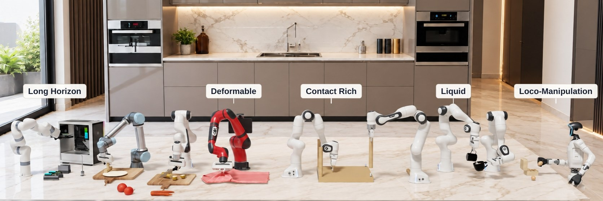
</p>

<p align="center">
  <a href="https://embodiedswe.github.io"></a>
  <a href="#"></a>
</p>

EmbodiedSWE studies how frontier coding agents can help robotics. It has four parts:

- **EmbodiedSWE-Bench**, an agent-native benchmark of long-horizon, dexterous everyday tasks, built on Isaac Lab.
- **Evaluation** of frontier coding agents on these tasks: task performance, completion time, and inference cost.
- **EmbodiedSWE-Gen**, which diversifies one verified agent solution into a large trajectory dataset for training general robot policies.
- **Agent improvement**, which generates new tasks from existing ones and improves the coding agent with RL on verified outcomes.

> **Note:** this repository is under active development. Folder layouts, interfaces, and settings
> may change as the codebase evolves.

## Installation

Requirements: Linux, an NVIDIA GPU with a CUDA 12.x driver, and [`uv`](https://docs.astral.sh/uv/).

```bash
git clone <this repo> && cd <this repo>
./scripts/bootstrap_isaaclab_5_1.sh      # Isaac Sim 5.1 + Isaac Lab 2.3.2 + robobench into ./.venv
source .venv/bin/activate
export OMNI_KIT_ACCEPT_EULA=YES               # Isaac Sim asks interactively otherwise (hangs headless runs)
# Optional: prefetch every task and room (~3.4 GB); otherwise env.build() fetches what it needs.
python -m robobench.scripts.fetch_assets
uv pip install "pin==2.7.0" "pin-pink==3.1.0" "daqp==0.8.5" "numpy==1.26.0"   # whole-body IK (pink_ik)
```

Task assets and shared rooms live in the Hugging Face dataset `EmbodiedSWE/robobench-assets`.
Building an environment automatically downloads its required asset groups and verifies their SHA-256
checksums against `robobench/assets_manifest.json`. Verified local copies are reused, including offline.
Listing tasks does not download anything. `fetch_assets --check` verifies the whole local collection.

Every built-in registered task configuration declares its default room in its suite's
`configs/envs.py`, including alternate robots and control modes. Shared loading code lives in
`robobench/core/rooms.py`; downloaded rooms live in the ignored `robobench/assets/rooms/` directory.
Use `--room none` with the smoke launcher or `cfg.build(room=None)` to disable scenery explicitly.
Set `COSIGEN_ASSET_DIR` before starting Python to use a writable cache outside the checkout.
See [task rooms and asset downloads](docs/rooms.md) for the room assignments and maintainer commands.

The `deformable` suite runs on the Newton physics backend and needs a separate venv; see
[`robobench/suites/deformable/README.md`](robobench/suites/deformable/README.md).

## Quick start

Preview a task:

```bash
python -m robobench.scripts.smoke --list                                          # all registered tasks
python -m robobench.scripts.smoke --env assembly.bulb.franka.osc --livestream 2   # random actions, live view
```

Tasks are named `suite.scene[.robot[.control_mode]]`. The environment API and design are described
in [`robobench/README.md`](robobench/README.md).

**A few examples from EmbodiedSWE-Bench:**

<table align="center">
  <tr>
    <td align="center">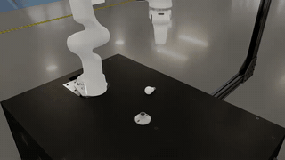<br><sub><code>assembly.bulb</code></sub></td>
    <td align="center">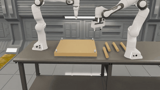<br><sub><code>assembly.ikea_table</code></sub></td>
    <td align="center">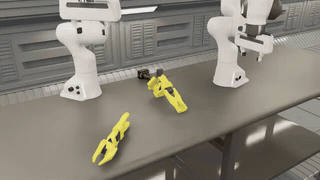<br><sub><code>assembly.so101</code></sub></td>
    <td align="center">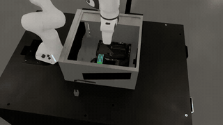<br><sub><code>assembly.pc_motherboard</code></sub></td>
    <td align="center">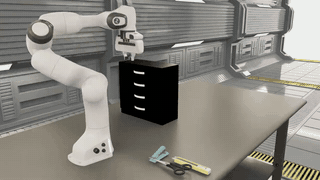<br><sub><code>packing.tool_packing</code></sub></td>
  </tr>
  <tr>
    <td align="center">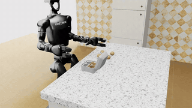<br><sub><code>packing.egg_carton</code></sub></td>
    <td align="center">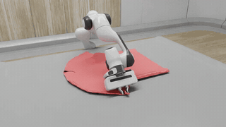<br><sub><code>deformable.tshirt</code></sub></td>
    <td align="center">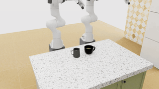<br><sub><code>deformable.latte</code></sub></td>
    <td align="center">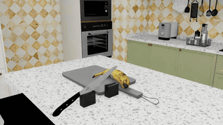<br><sub><code>cutting.slice</code></sub></td>
    <td align="center">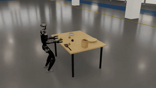<br><sub><code>locomanip.fruit_delivery</code></sub></td>
  </tr>
</table>

## Solving a task

The easy way: open the repo in a coding agent such as Claude Code or Codex, point it at
`robobench/README.md`, and ask it to solve a task, e.g. `assembly.bulb.franka.osc`. A solution is a
Python program exposing `solve(env)`; the contract the agents see is
[`eval/prompts/_contract.md`](eval/prompts/_contract.md).

For rigorous, large-scale evaluation, `eval/` runs the agent in an isolated Docker container under a
time budget and grades its solutions afterwards in fresh containers on independently randomized episodes.

```bash
python eval/scripts/build_env.py --name bulb_e2e --stage bulb:franka    # build the world once
python eval/scripts/run_agent.py experiments/bulb_e2e --agent claude    # one agent run in Docker
python eval/scripts/run_grade.py experiments/bulb_e2e --run <run>       # grade the delivery
```

Prompt conditions (hints, rules, blocked features) are authored yaml files in `eval/configs/` and
`eval/prompts/`. Docker images and the container contract are documented in
[`eval/docker/README.md`](eval/docker/README.md).

## Data engine

Once a task is solved, `data_engine/` turns that one verified solution into a large, diverse,
per-episode-verified demonstration dataset. Coding agents author the diversity at five independent
levels: scene, strategy, phase, dynamics, and visual.

A generic launcher then mass-produces batched episodes, the scene's grader stamps a verdict on each
one, and the verified episodes are rendered and baked into a LeRobot dataset for policy training.

```bash
python data_engine/scripts/init_gen.py experiments/bulb_e2e/runs/<run>                  # start a campaign from a solved run
python data_engine/scripts/diversify.py <gen_root> data_engine/configs/scene_default.yaml # agent session that adds diversity
python data_engine/scripts/generate.py --headless <gen_root> --scene scene_1 --num_envs 8 # generate + verify a batch
python data_engine/scripts/render.py --headless <gen_root> --batches <batch>              # render episodes to video
.venv-lerobot/bin/python vla/convert/convert.py <gen_root> --repo-id <name>               # bake a LeRobot dataset
```

Training and closed-loop evaluation of VLA policies live in [`vla/`](vla/README.md).

## Repository layout

```
robobench/            EmbodiedSWE-Bench: the benchmark package
  core/               BaseEnv, BaseScene, BaseRobot, controller and grader contracts, registries
  suites/             task suites: assembly, packing, puzzle, deformable, cutting, locomanip
  robots/             embodiments: franka, xarm7, attached (Kinova Gen3 + panda hand), g1, multi (bimanual), ...
  controllers/        joint, diff_ik, task_space (OSC / impedance), pink_ik, composite, loco_policy
  scripts/smoke.py    build and step any registered env
eval/                 dockerized agent evaluation
data_engine/          EmbodiedSWE-Gen: expands one solution into diverse trajectories
vla/                  bake episodes into LeRobot datasets, train and evaluate VLA policies
rl/                   RL baselines (not agent improvement)
sim_gen/              generates new simulation tasks from seed tasks (agent improvement)
real_to_sim/          real scenes and objects to sim: splat backgrounds, photos to sim-ready assets
scripts/              bootstrap installers, record_video.py, asset vendoring
```

## Citation

If you use EmbodiedSWE in your research, please cite this repository:

```bibtex
@misc{embodiedswe2026,
  title        = {EmbodiedSWE: Coding Agents for Long-Horizon Dexterous Robotics},
  author       = {You, Haoxiang and Shen, Zeyu and Liu, Yilang and Zheng, Zhicheng and Zha, Lihan and
                  Yamazaki, Kashu and Zhang, Mingtong and Huang, Suning and Sun, Jiankai and
                  Chen, Qianzhong and He, Lucy and Chang, Haoran and Shah, Dhruv and Schwager, Mac and
                  Fragkiadaki, Katerina and Henderson, Peter and Abraham, Ian and Xu, Canwen},
  year         = {2026},
  howpublished = {\url{https://embodiedswe.github.io}},
}
```

## License

Apache 2.0. See [LICENSE](LICENSE).

Built on [Isaac Lab](https://github.com/isaac-sim/IsaacLab), [Newton](https://github.com/newton-physics/newton),
and [LeRobot](https://github.com/huggingface/lerobot).
